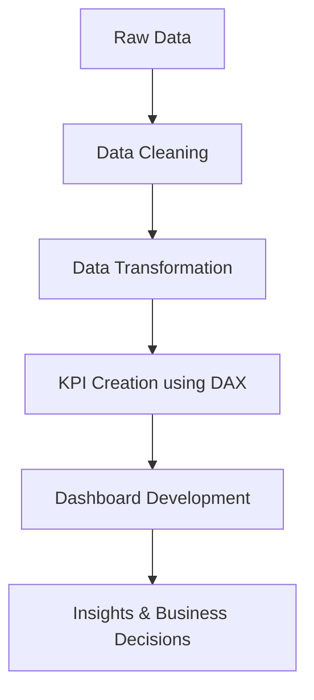

# 🛒 Blinkit Sales Analysis Dashboard | Power BI | Data Analytics Project


---

## 📌 Business Problem
Retail businesses often struggle to track sales performance across multiple outlets, product categories, and customer preferences.

This project solves that by building an **interactive analytics dashboard** that enables stakeholders to:
- Monitor KPIs in real-time  
- Identify top-performing products  
- Understand customer buying behavior  

---

## 🎯 Key Business Goals
- Improve sales visibility across outlets  
- Identify high & low performing product categories  
- Enable data-driven decision-making  
- Track KPI performance effectively  

---

## 🛠️ Tech Stack
- **Power BI** – Data Visualization  
- **Excel** – Data Source  
- **DAX** – Data Modeling & KPIs  

---

## 📊 Key Metrics (KPIs)
| Metric | Value |
|------|------|
| 💰 Total Sales | 1.20M+ |
| 📉 Avg Sales | $141 |
| 📦 Total Items | 8,523 |
| ⭐ Avg Rating | 3.9+ |

---

## 📈 Key Insights (Business Impact)
- 🥗 Low-fat products generated **~65% higher revenue**
- 🏪 Medium outlets contributed the **highest sales share**
- 🍎 Fruits & Vegetables are **top revenue drivers**
- 🐟 Seafood is **underperforming category**
- 📅 2018 recorded **peak sales performance**

---

## 🧠 Skills Demonstrated
- Data Cleaning & Transformation  
- Data Modeling  
- DAX Calculations  
- Business Insight Generation  
- Dashboard Design (UI/UX)  
- Data Storytelling  

---

## 📂 Project Workflow


---

## 🧮 DAX Measures
```DAX
Total Sales = SUM('BlinkIT Grocery Data'[Sales])
Average Sales = AVERAGE('BlinkIT Grocery Data'[Sales])
Average Rating = AVERAGE('BlinkIT Grocery Data'[Rating])
Number of Items = COUNTROWS('BlinkIT Grocery Data')
```

---

## 📸 Dashboard Preview
> 💡 Add screenshots in this order:
1. Full Dashboard View  
2. KPI Overview  
3. Category Analysis  
4. Outlet Analysis  
5. Trend Analysis  

---

## 🚀 How to Run
1. Download `.pbix` file  
2. Open in Power BI Desktop  
3. Interact using filters  

---

## 💼 Why This Project Matters
This project simulates a **real-world retail analytics use case**, demonstrating how data can:
- Improve business performance  
- Drive strategic decisions  
- Identify revenue opportunities  

---

## 📢 Let's Connect
If you're a recruiter or data enthusiast, feel free to connect!

⭐ Star this repo if you found it useful!
